  

  
  
  

 

Estudio de software en Buenos Aires. Hacemos **sistemas de gestión, apps para iPhone y Mac, plataformas web, automatización e integraciones con IA** para equipos que las usan todos los días. Una llamada de 30 minutos, un prototipo clickeable en dos semanas, y un equipo que se queda después del lanzamiento.

Software studio based in Buenos Aires — management systems, native Apple apps, web platforms, Python automation and AI integrations. We ship to production and stay after launch.

 

## Qué hacemos

<table>
  <tr>
    <td width="33%" valign="top">
      <h3>Sistemas internos</h3>
      Turnos, gestión, stock, facturación. Lo que hoy vive en planillas y WhatsApp, ordenado en una herramienta que tu equipo aprende en días.
    </td>
    <td width="33%" valign="top">
      <h3>Apps para iPhone y Mac</h3>
      Nativas, en Swift y SwiftUI. Rápidas, con notificaciones, offline cuando hace falta, publicadas en el App Store.
    </td>
    <td width="33%" valign="top">
      <h3>Sitios web y tiendas</h3>
      Sitios para profesionales, clínicas y negocios, y tiendas con carrito, Mercado Pago y envíos. Rápidos, medibles, primeros en Google.
    </td>
  </tr>
  <tr>
    <td valign="top">
      <h3>Automatización en Python</h3>
      Scripts, scraping, reportes, pipelines de datos. Lo que alguien hace a mano todos los lunes, corriendo solo y avisando por WhatsApp si algo falla.
    </td>
    <td valign="top">
      <h3>Chatbots e IA</h3>
      Bots para web y WhatsApp que responden con tus propios datos, clasificación de documentos, búsqueda en lenguaje natural. Y si un <code>if</code> lo resuelve, no le ponemos IA.
    </td>
    <td valign="top">
      <h3>Integraciones</h3>
      WhatsApp, Mercado Pago, obras sociales, facturación electrónica AFIP, tu ERP. Conectamos lo que ya usás para que nadie cargue datos dos veces.
    </td>
  </tr>
</table>

 

## Producto propio

**Sistema de gestión médica** — turnos, historia clínica, estudios y facturación AFIP en un solo lugar. En producción en un centro real desde 2023; white-label, cada clínica con su nombre y su logo.

| Demo interactiva | Qué muestra |
|---|---|
| [Sistema médico](https://austral-studio.com/demo/clinica) | Turnera, dashboard, historia clínica por rol |
| [App de pacientes](https://austral-studio.com/demo/paciente) | Próximo turno, confirmar/reprogramar, resultados |
| [Distribuidora](https://austral-studio.com/demo/distribuidora) | Pedidos, stock, reparto y cobranzas |
| [Tienda online](https://austral-studio.com/demo/tienda) | Catálogo, carrito, Mercado Pago |
| [Sitio de clínica](https://austral-studio.com/demo/clinica-web) | Landing SEO por estudio, turnos por WhatsApp |
| [Bot de WhatsApp](https://austral-studio.com/demo/bot) | Califica consultas y deriva a una persona |

Todas las demos se pueden tocar: datos ficticios, nada se guarda fuera de tu navegador.

 

## Stack

  
  
  
  
  
  
  
  
  
  
  
  
  
  
  
  
  

 

## Contacto

**[austral-studio.com](https://austral-studio.com)** · **[hola@austral-studio.com](mailto:hola@austral-studio.com)** · Buenos Aires, Argentina

 

© 2026 Austral Studio

